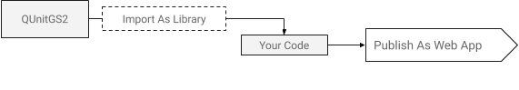
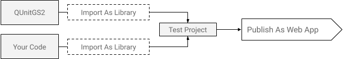
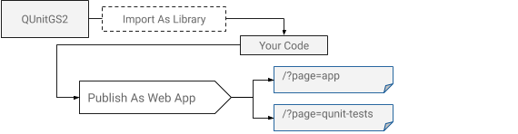

QUnitGS2 brings [QUnit](https://qunitjs.com/) testing to
[Google Apps Script](https://developers.google.com/apps-script). Write a small
test, open a web page, and see whether your code does what you expect.
No local development tools are required.

! **New here?** [Run your first tests with the quick start guide.](/quick-start-guide)

## How it works

1. Add QUnitGS2 as a library in your Apps Script project.
2. Add a test runner and tests alongside your server-side JavaScript.
3. Open the project's web app URL to run the tests and display the results.

**Your tests run on Google's servers, not in the browser.** The browser displays
the finished results. Each reload runs the tests again, including any calls that
write to a spreadsheet, send email, or change files. Start with pure functions
and use disposable test data when testing Google services.

## Find the guide you need

| I want to... | Start here |
| --- | --- |
| Copy working code and get a green result | [Quick start](/quick-start-guide) |
| Learn by finding and fixing a bug | [Step-by-step tutorial](/examples/step-by-step-tutorial) |
| Choose assertions and organize a growing suite | [Write and organize tests](/how-to-guides/writing-tests) |
| Test spreadsheet logic without touching real data | [Test spreadsheet code](/how-to-guides/testing-spreadsheet-code) |
| Add tests to a project that already has a web app | [Test an existing project](/how-to-guides/testing-existing-projects) |
| Fix an empty page, missing tests, or outdated results | [Troubleshooting](/troubleshooting) |

## Choose where your tests live

### In the project you are testing

For a script without an existing web app, keep the code and tests together.
The [quick start](/quick-start-guide) sets up a `doGet()` function that serves
the test results.

### In a separate test project

For a published application, a separate runner keeps test endpoints out of the
production app. Import both QUnitGS2 and your application as libraries, then test
the application's exported functions.

### Alongside a private web app

You can also use one `doGet(e)` router to select the app page or the test page.
Only do this in a project whose access is restricted to trusted testers: a
`?page=tests` parameter is not access control.

The [existing-project guide](/how-to-guides/testing-existing-projects) walks
through both approaches.

## What can I test?

QUnitGS2 is a good fit for calculations, validation, data transformations, and
synchronous Apps Script service calls. Use the
[QUnit assertion reference](https://api.qunitjs.com/assert/) for assertion details,
but check that an API exists in your selected library version.

It is not a browser automation tool. There is no browser DOM in server-side
Apps Script, and timers, promises, and asynchronous workflows do not behave like
they do in browser QUnit. See [runtime limitations](/troubleshooting#runtime-limitations)
before adapting a browser test suite.

## Reading test failures

With QUnit's default exception handling, an uncaught exception in a test or in a
`before`, `beforeEach`, `afterEach`, or `after` hook is reported as a failed
assertion. The results page shows the failure message and available source
details, and subsequent tests continue. Use `assert.throws` when an exception
is the expected behavior.

Earlier library versions could lose these failures while generating a diff.
Select a published library version containing the fix, or use the updated
source. Updating this repository or your web app alone does not update a pinned
library version. See the [changelog](https://github.com/artofthesmart/QUnitGS2/blob/master/CHANGELOG.md)
and [test suite guide](/examples/qunitgs2-test-suite) for details.
