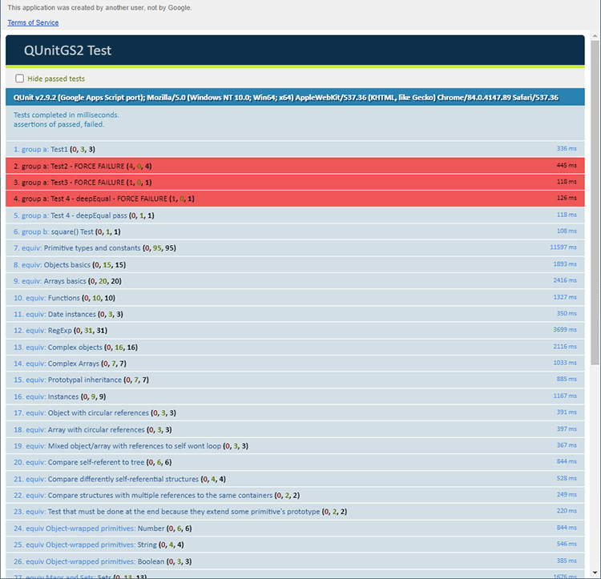

The [consolidated live test source](https://github.com/artofthesmart/QUnitGS2/tree/master/tests/live) and
[Apps Script test project](https://script.google.com/d/1cmwYQ6H7k6v3xNoFhhcASR8K2_JBJcgJ2W0WFNE8Sy3fAJzfE2Kpbh_M/edit)
provide a larger example based on tests from the original QUnit library. Use
them as a reference after you have a [small runner working](/quick-start-guide).

===

## How to explore it

1. Open the test project to browse its source. You do not need to edit it to
   follow the documentation.
2. Find `doGet()` and follow the functions that register its tests. Notice the
   separation between the runner and the test groups.
3. Pick a test for an assertion you use, such as `strictEqual` or `deepEqual`.
   Read its inputs, expected value, and assertion message together.
4. Adapt the pattern to your own project rather than copying the entire suite.
   The [writing tests guide](/how-to-guides/writing-tests) shows a smaller
   multi-file setup.

## View the hosted results

You can [open the historical hosted test runner](https://script.google.com/macros/s/AKfycbxGNuNyR-pec75X_whqf56rkoi8-8ne5aeK8bdctR-uyq5Wjwht/exec).
Opening it runs the suite; it is not a static report. A large run can take around
two minutes, so avoid repeatedly refreshing while it is working.
Its source and library versions may differ from the current repository; it is
not proof that the latest changes have been deployed.

The results page should resemble this example:



These tests help compare this adaptation with
[upstream QUnit tests](https://github.com/qunitjs/qunit/tree/main/test/main).
A passing hosted suite does not verify your application's behavior or the
library version selected in your project. Run your own tests too.

If the shared project or hosted deployment is unavailable, you can still use the
self-contained [quick start](/quick-start-guide) and
[tutorial](/examples/step-by-step-tutorial); neither depends on that deployment.

## One-command live testing

The test sources now live alongside the library in `tests/live`. After the
[one-time clasp and web-app setup](https://github.com/artofthesmart/QUnitGS2/blob/master/tests/live/README.md),
run `npm run test:live` to build the current sources, push only to the test
project, redeploy, and retrieve correlated JSON results with wget.
The automated suite excludes intentional failures and unsupported asynchronous
suites. On an updated deployment, `?demo=failures` enables the failure examples.
The published library deployment is not changed.

## Exception reporting regressions

The opt-in `?suite=exceptions` route is implemented in
[artofthesmart/QUnitGS2-Test#4](https://github.com/artofthesmart/QUnitGS2-Test/pull/4),
which is not yet merged into the companion repository's `master` branch.
Use a test project containing that PR's source and a QUnitGS2 library version
with the exception-reporting fixes. Neither a runner copied from companion
`master` nor this repository's consolidated live runner includes that route.
The hosted deployment should not be assumed to support it. That companion
change leaves its default suite unchanged.

The regression suite intentionally throws strings and `Error` objects before
and after assertions and in all four setup/teardown hooks. It also tests
`assert.throws`, comparison values, and recovery after each throwing case.
Expected results are **29 test rows and 45 assertions: 28 passed, 17 failed**.
Of the test rows, **14 pass and 15 fail**. These failures are intentional: the
regression is successful when every expected failure and subsequent recovery
test is visible and the totals match, not when the page is all green.

Check that exception messages appear as text, source details appear when
available, and the final passing test is present. A blank page, missing totals,
or missing failure rows does not count as success. See the companion
[test instructions on the exception-integration branch](https://github.com/artofthesmart/QUnitGS2-Test/blob/artofthesmart-exception-integration-regressions/test/README.md)
for the exact cases.

### Testing an unpublished library change

Use a disposable test project. For a published library, select a version that
contains the fix. To test saved but unpublished library source, editors of that
library can use its development mode with an existing version selected. The
consumer web app's `/dev` URL uses saved consumer code; it does not automatically
enable development mode for an imported library.

Merging a GitHub PR does not publish a new Apps Script library version or update
an existing consumer's binding.

## Local checks when live testing is difficult

In the QUnitGS2 library checkout, Node.js 22 or later can run the collection
tests without installing packages:

```sh
node --test tests/*.test.cjs
```

For the complete local collection and Chromium browser checks:

```sh
npm ci
npx playwright install chromium
npm run test:all
```

The tests use the bundled QUnit engine and the library's actual result
collection and rendering code. Browser checks verify messages, source details,
totals, subsequent tests, and collapse/filter controls. The companion
exception-integration branch also has a local verifier that calls its real
consumer entry points against a local library checkout.

These checks substitute Apps Script services and do not validate Google's
deployment, authorization, cache quotas, or runtime scheduling. They provide
offline regression coverage, not a guarantee that a particular deployed
project is correctly configured.
