Let's work through a step-by-step example of how to get QUnit set up for a new project.  It seems more complicated here, but once you get the hang of it, you can add tests to your projects in less than a minute.

===

Start by loading the [Apps Script home page](https://script.google.com/home), and then creating a new project.

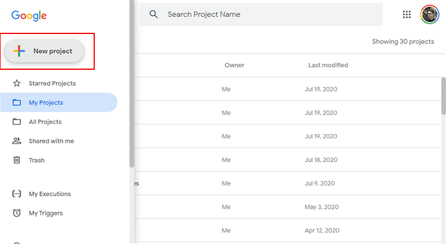

Go ahead and name the project by clicking the “Untitled Project” along the top.  Then click OK.

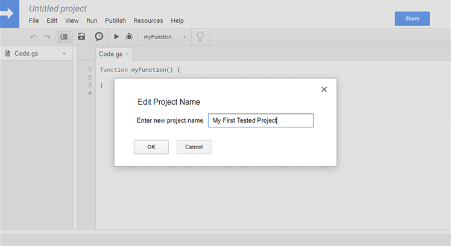

We need to add the QUnit library, so click `Resources` > `Libraries…` in the menu bar.

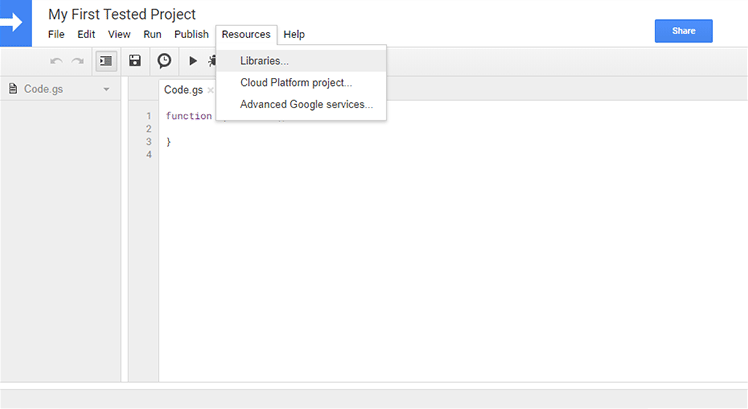

Now copy the library ID below and paste it into the box that says `Add a library`.  Click add.

**Library ID:** `1tXPhZmIyYiA_EMpTRJw0QpVGT5Pdb02PpOHCi9A9FFidblOc9CY_VLgG`

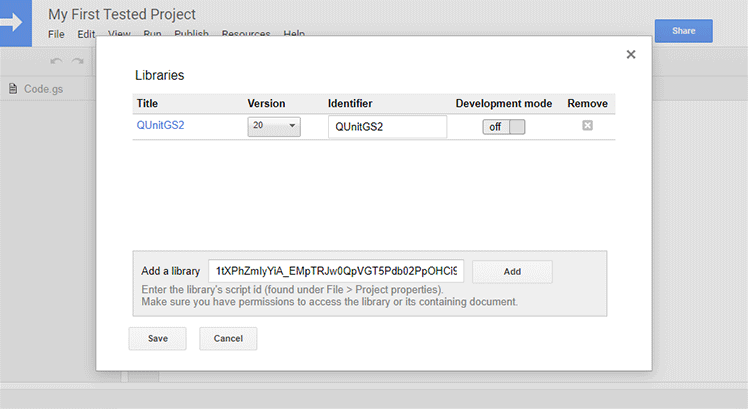

Great!  The library is added.  Now let’s add another script file that will run those tests.  Click `File` > `New` > `Script file`.

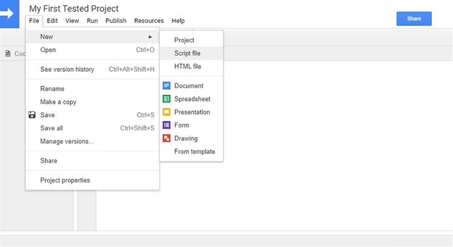

Give it a name, and click `OK`.

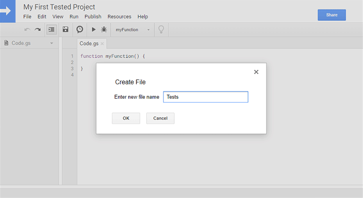

Now copy the code below and paste it into the new `Tests.gs` file.  This code is important. If you want to know more about what it does, read the full guide on the home page.

```javascript
// Alias used by the examples below.
var QUnit = QUnitGS2.QUnit;

// HTML get function
function doGet() {
   QUnitGS2.init();

   /**
   * Add your test functions here.
   */

   QUnit.start();
   return QUnitGS2.getHtml();
}

// Retrieve test results when ready.
function getResultsFromServer() {
   return QUnitGS2.getResultsFromServer();
}
```

!! **Important:** If your tests are defined as functions outside of where you plan to run them, like in the [QUnitGS2 test suite](https://script.google.com/d/1cmwYQ6H7k6v3xNoFhhcASR8K2_JBJcgJ2W0WFNE8Sy3fAJzfE2Kpbh_M/edit), then be mindful of your file load order. Said another way, be sure that your tests run pretty much in the last file on the list.  Before the V8 runtime in Apps Script, you didn't need to worry about the order in which your files loaded.  _Now_ the load order matters, [read more about it here](https://developers.google.com/apps-script/guides/v8-runtime/migration#avoid_calling_functions_before_they_are_parsed). Normally it starts with the oldest files and finishes with the newest ones, but you can also sort alphabetically from the menu bar with `View` > `sort files alphabetically`.  If you use the [Apps Script Color Chrome extension](https://chrome.google.com/webstore/detail/appsscript-color/ciggahcpieccaejjdpkllokejakhkome?hl=en) then it's hard to know what your load order is, so be careful.

Now your code file will look like this.

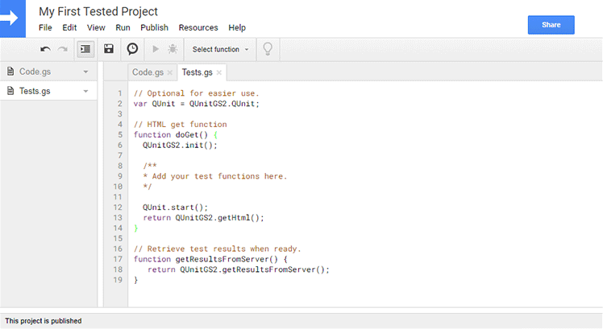

Go back to your Code.gs file using the pane on the left, and now let’s write a simple function that we can test.

```javascript
function divideThenRound(numerator, denominator) {
  return numerator/denominator;
}
```

It’ll look like this.

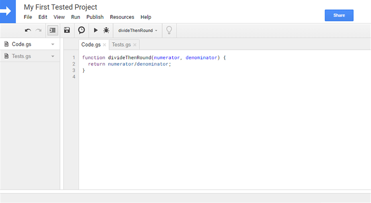

Now click `Publish` > `Deploy as web app…` in the menu bar.

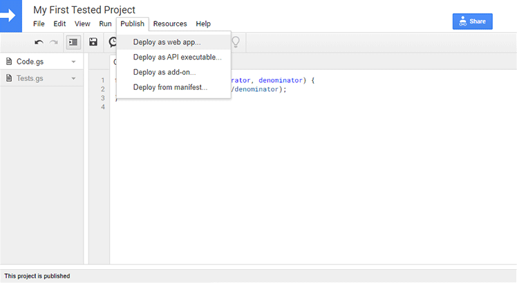

Name your new project version, and click `Deploy`.

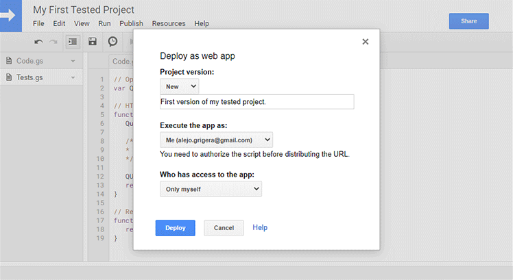

Great!  Now your web app is deployed and loadable as an HTML web page.  You’ll see the dialog below with a URL linking to your test results.  If you look closely, there are actually _two_ links in this dialog.  The one in the text box is a link to the “deployed” version of your tests, and that link will only be updated when you re-deploy your web app with a new version.  The link that says `latest code` will always use whatever code you’re currently working on, regardless of whether you’ve re-deployed or not.

You can use the first one for clients or your team so they only see the stable “releases”, while you can use the second one for testing and rapid development.

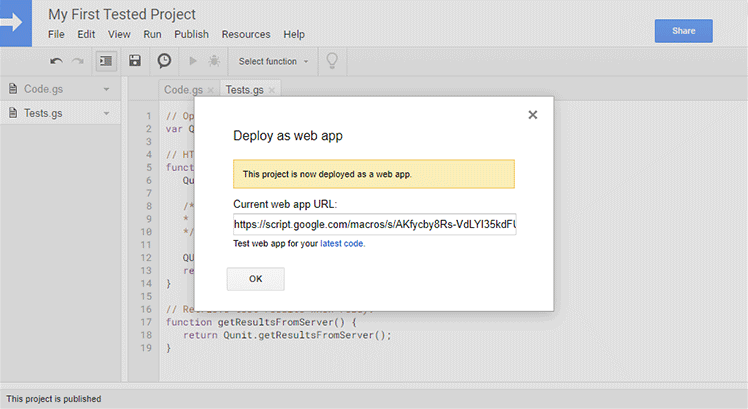

Try clicking the `latest code` link and you’ll see something like what’s shown below. We don’t have any tests yet!

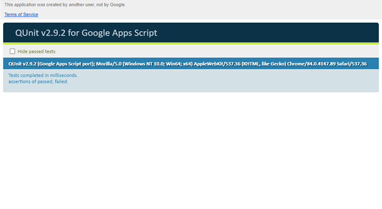

Let’s write some tests!  Remove the commented section that says `Add your test functions here.` and replace it with the code below.

```javascript
QUnit.module("Basic tests");
  
  QUnit.test("simple numbers", function( assert ) {
    assert.equal(divideThenRound(10, 2), 5, "whole numbers");
    assert.equal(divideThenRound(10, 4), 3, "decimal numbers");
  });
```

Now your code file will look like the picture below.

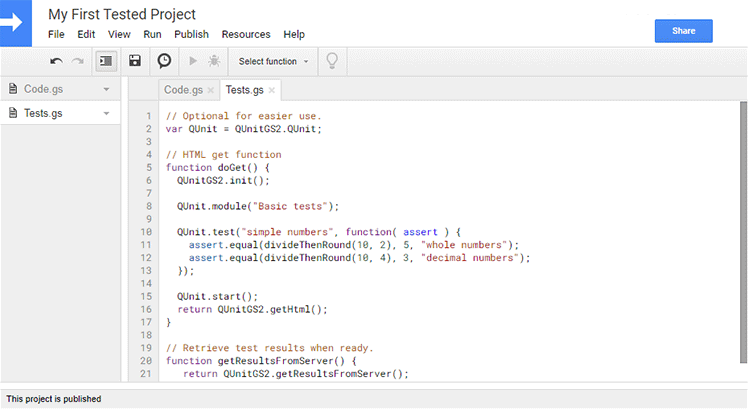

If you reload your QUnit tests page, you’ll find that one test passes but the other fails.  

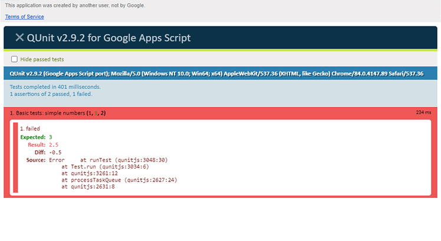

Oh no!  It’s because the function was expected to return the rounded result of dividing the two numbers, but instead it just returns the division.  Let’s update our `Code.gs` file to do the right thing.

```javascript
function divideThenRound(numerator, denominator) {
  return Math.round(numerator/denominator);
}
```

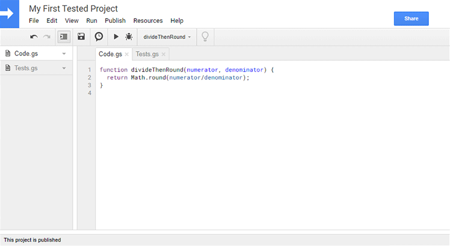

Now if you reload the tests page, you’ll find that both tests pass!  

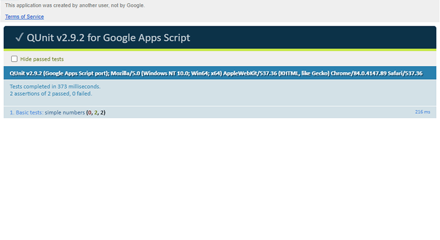

We did it!  Using unit testing, we found a bug in our code and fixed it so that all tests pass.  Now we’ll feel confident adding to this code or editing it, knowing that if we ever cause a breakage somewhere, it’ll appear in our tests.

## When a test throws an exception

With QUnit's default exception handling, unexpected exceptions in tests and
setup/teardown hooks appear as failed assertions with their messages. Subsequent
tests continue. Use `assert.throws` to test a function that is supposed to throw;
do not wrap an unexpected exception in a catch block just to keep the test
results visible.

Older QUnitGS2 library versions could lose tests that threw exceptions. To get
the fix, select a published library version containing it or use the updated
source. The consumer web app's latest-code URL does not override its selected
library version. See the [test suite guide](/examples/qunitgs2-test-suite) for
the exception regression suite and expected results.
